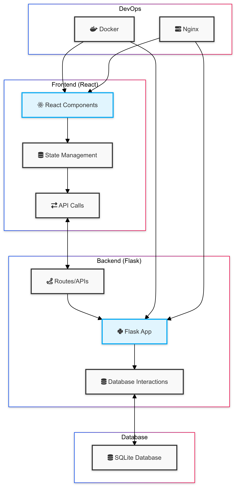

# Full Stack React and Flask App

This repository contains a full stack application built with React for the frontend and Flask for the backend. It's a task management system that allows users to create, read, update, and delete tasks.

## Features

- Create new tasks
- Mark tasks as completed
- Delete tasks
- Filter tasks (All, Active, Completed)
- Search tasks
- Responsive design
- Animated UI elements using Framer Motion

## Tech Stack

- Frontend: React, Tailwind CSS, Framer Motion
- Backend: Flask
- Database: SQLite
- Containerization: Docker

## System Architecture Diagram



The image above illustrates the system architecture of our application. It shows the interaction between different components, including the frontend React application, backend Flask server, and the SQLite database. The DevOps section highlights the use of Docker for containerization and Nginx for serving the application.

## Getting Started

### Prerequisites

- Docker and Docker Compose

### Running the Application

1. Clone the repository:
   ```
   git clone https://github.com/TheToriqul/Full-Stack-React-and-Flask-App.git
   cd Full-Stack-React-and-Flask-App
   ```

2. Build and run the Docker containers:
   ```
   docker-compose up --build
   ```

3. Access the application at `http://localhost:3000`

## Project Structure

```
Full-Stack-React-and-Flask-App/
├── backend/
│   ├── app.py
│   ├── Dockerfile
│   └── requirements.txt
├── frontend/
│   ├── public/
│   ├── src/
│   │   ├── App.js
│   │   └── index.js
│   ├── Dockerfile
│   └── package.json
├── assets/
│   └── system-design.png
├── docker-compose.yml
└── README.md
```

## How I Use This Repo

This repository serves as a playground for me to practice and experiment with full stack development, DevOps practices, and containerization. I use it to:

1. Implement new features and improvements in both frontend and backend.
2. Practice Docker containerization and orchestration with Docker Compose.
3. Experiment with different UI libraries and design patterns.
4. Learn about API design and implementation using Flask.
5. Explore best practices in full stack application architecture.

## Note

This is a personal practice repository. The code here may not be optimized or follow best practices in all cases, as it represents my learning journey.

## Contributing

Contributions, issues, and feature requests are welcome. Feel free to check [issues page](https://github.com/TheToriqul/Full-Stack-React-and-Flask-App/issues) if you want to contribute.

## Contact

For any questions or inquiries regarding the project, please feel free to contact me:

- Email: toriqul.int@gmail.com
- Phone: +65 8936 7705, +8801765 939006

---

Copyright © 2024 TheToriqul. All Rights Reserved.